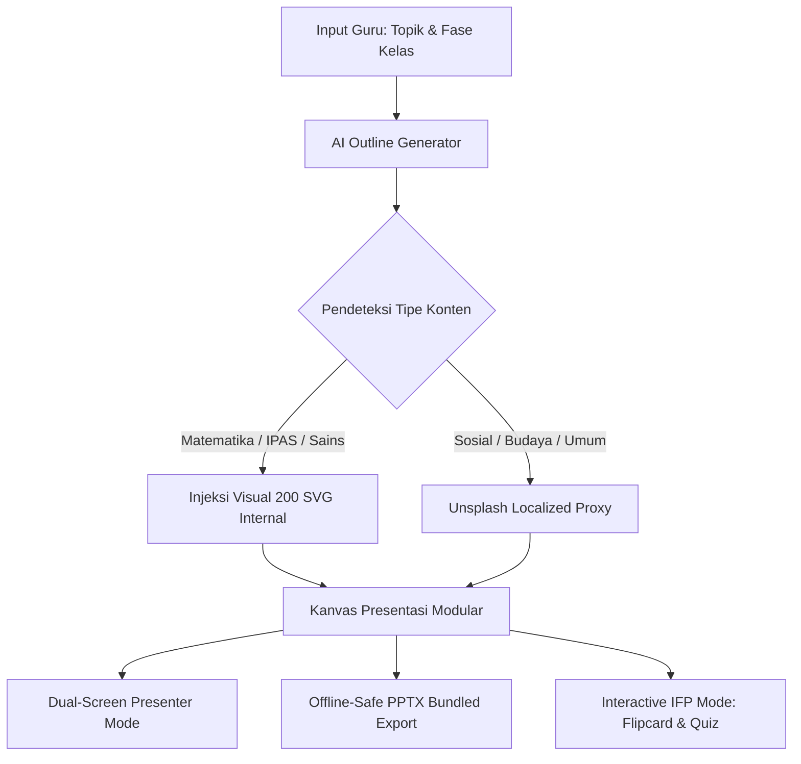

# 📘 BEDAH & KRITIK MENDALAM: PILAR 3 & PILAR 4
**Proyek:** Ruang Kerja Pendidik — KKG Gugus 3 Wanayasa (`RuangKKG`)  
**Fokus:** Pilar 3 (Presentasi & Media Ajar Interaktif) & Pilar 4 (Administrasi, Tata Usaha & Program Sekolah)  
**Tanggal Analisis:** 4 Oktober 2026  
**Status:** Dokumen Strategis & Panduan Teknis Naik Level (Level-Up Blueprint)

---

## 📑 DAFTAR ISI
1. [Executive Summary Pilar 3 & Pilar 4](#executive-summary)
2. [PILAR 3: Presentasi & Media Ajar Interaktif](#pilar-3-presentasi--media-ajar-interaktif)
   - [2.1 Anatomi & Arsitektur Saat Ini](#21-anatomi--arsitektur-saat-ini)
   - [2.2 Kritik Tajam & Titik Rapuh Tiap Sub-Fitur](#22-kritik-tajam--titik-rapuh-tiap-sub-fitur)
   - [2.3 Solusi Konkret & Blueprint Naik Level Pilar 3](#23-solusi-konkret--blueprint-naik-level-pilar-3)
3. [PILAR 4: Administrasi, Tata Usaha & Program Sekolah](#pilar-4-administrasi-tata-usaha--program-sekolah)
   - [3.1 Anatomi & Arsitektur Saat Ini](#31-anatomi--arsitektur-saat-ini)
   - [3.2 Kritik Tajam & Titik Rapuh Tiap Sub-Fitur](#32-kritik-tajam--titik-rapuh-tiap-sub-fitur)
   - [3.3 Solusi Konkret & Blueprint Naik Level Pilar 4](#33-solusi-konkret--blueprint-naik-level-pilar-4)
4. [Tabel Perbandingan: Kondisi Saat Ini vs Target Naik Level](#tabel-perbandingan)
5. [Roadmap Eksekusi Bertahap (Sprint 1 - 3)](#roadmap-eksekusi-bertahap)

---

<a id="executive-summary"></a>
## 1. 📊 EXECUTIVE SUMMARY

Pilar 3 dan Pilar 4 merupakan **dua pilar dengan beban kerja administratif dan pedagogis paling nyata** bagi guru dan kepala sekolah di lingkungan KKG Gugus 3 Wanayasa:
* **Pilar 3 (Presentasi & Media Ajar)** menentukan kualitas pengalaman belajar murid di kelas saat guru mengajar menggunakan proyektor atau *Interactive Flat Panel (IFP)*.
* **Pilar 4 (Administrasi & Program Sekolah)** menentukan akuntabilitas hukum, ketertiban anggaran (BOS/BOP), kepatuhan terhadap regulasi baru Kemendikdasmen (Permendikdasmen 13/2025, 7 KAIH, 8 Dimensi Profil Lulusan), serta kelancaran birokrasi kedinasan guru.

**Kesimpulan Evaluasi:**  
Secara substansi, kedua pilar ini memiliki keunggulan yang sangat langka: *pemahaman regulasi lokal Purwakarta yang mendalam* dan *desain estetika yang modern*. Namun, dari sudut pandang *Software Engineering* dan *User Experience*, terdapat **titik rapuh kritis (fragility points)**:
1. Generator slide mengabaikan aset terbesar proyek ini (200 mesin visual SVG internal) dan masih bergantung pada gambar luar.
2. Generator PPTX mengandalkan dynamic CDN script dan rawan crash saat offline.
3. Modul surat melakukan runtime `ALTER TABLE` di dalam HTTP request handler—sebuah *anti-pattern* berbahaya di Cloudflare D1.
4. Absensi QR tidak memiliki enkripsi rolling-token atau validasi geofence, membuka celah manipulasi kehadiran.
5. Modul LPJ menggunakan *RegEx string slicing* untuk parsing teks AI alih-alih skema JSON terstruktur.

---

<a id="pilar-3-presentasi--media-ajar-interaktif"></a>
## 2. 🎨 PILAR 3: PRESENTASI & MEDIA AJAR INTERAKTIF

### 2.1 Anatomi & Arsitektur Saat Ini
* **Backend:** [`src/routes/presentation.ts`](file:///c:/Users/Andris%20PC/Pictures/genspark/webapp/src/routes/presentation.ts) (709 baris).
  - Skema validasi outline dan generate berbasis Zod (`presentationOutlineSchema`, `presentationGenerateSchema`).
  - Pembersihan CoT (*Chain-of-Thought*) pada catatan pembicara (*speaker notes*).
  - Integrasi API eksternal Unsplash (`src/services/unsplash.ts`) untuk pencarian foto.
* **Frontend:** [`public/static/js/pages/slide.js`](file:///c:/Users/Andris%20PC/Pictures/genspark/webapp/public/static/js/pages/slide.js) (3.022 baris, 166 KB).
  - 13 Layout modular (`title`, `content`, `twoColumn`, `imageText`, `timeline`, `stats`, `comparison`, `quiz`, `flipcard`, `activity`, `quote`, `summary`, `thankyou`).
  - 9 Skema warna/template (Dark Elegance, Modern Flow, Neo Clean, Vibrant Creative, Aurora Borealis, Sunset Academia, Ocean Deep, Neon Sakura, Golden Hour).
  - Alur dua tahap: Perancangan Outline $\rightarrow$ Generate Slide Lengkap.
  - Ekspor ke PowerPoint `.pptx` menggunakan pustaka eksternal `pptxgenjs`.

---

### 2.2 Kritik Tajam & Titik Rapuh Tiap Sub-Fitur

#### 🔴 Titik Buta Terbesar (The Biggest Blindspot): Visual Internal 200 SVG Tidak Dimanfaatkan
* **Masalah:** Proyek ini memiliki mesin visual internal yang luar biasa di [`src/lib/visual-engine.ts`](file:///c:/Users/Andris%20PC/Pictures/genspark/webapp/src/lib/visual-engine.ts) dengan 200 generator SVG parametrik murni (geometri, pecahan, neraca, organ tubuh, jam dinding analog, rantai makanan, peta buta). Namun, `presentation.ts` **sama sekali tidak terhubung** ke mesin visual ini!
* **Dampak:** Saat guru SD membuat presentasi *"Pecahan Matematika Kelas 4"* atau *"Sistem Pencernaan Kelas 5"*, generator slide malah mencari foto di Unsplash dengan query bahasa Inggris yang sering kali menampilkan foto abstrak orang dewasa di kantor atau gambar tidak relevan.
* **Tuntutan Naik Level:** Slide generator harus mengenali domain topik (Matematika/IPAS/Sains) dan memanggil langsung generator SVG internal yang tajam, akurat, dan 100% relevan dengan kurikulum SD.

#### 🔴 Kerapuhan Ekspor PowerPoint (`pptxgenjs` via CDN)
* **Masalah:**
  1. `slide.js` baris 1689 memuat pustaka dari CDN saat tombol ekspor diklik:  
     `await loadScript('https://cdn.jsdelivr.net/npm/pptxgenjs@3.12.0/dist/pptxgen.bundle.js')`. Jika laptop guru sedang offline atau kuota internet sekolah lambat, ekspor PPTX langsung gagal total.
  2. Bounding-box kalkulasi teks bersifat statis (`safeW = totalW - 1.6`). Teks hasil AI yang panjang akan meluap (*overflow*) menabrak batas bawah slide PowerPoint asli.
  3. Image proxying menggunakan `fetch(url) -> FileReader -> dataUri`. Jika gambar Unsplash mengalami proteksi CORS atau rate limit, proses ekspor PPTX macet di tengah jalan.
* **Tuntutan Naik Level:** Bundle pustaka PPTX secara lokal/vendor, terapkan *auto-shrink font size* berbasis panjang karakter, dan sediakan *image fallback* elegan jika fetching gambar gagal.

#### 🔴 Keterbatasan Kanvas Editor & Manipulasi DOM Monolitik
* **Masalah:** `slide.js` berukuran 166 KB dalam satu file monolitik. Pengeditan teks slide dilakukan dengan event `contenteditable` ad-hoc. Ketika guru mengubah teks judul di slide 3, state tidak tersimpan ke *history stack* (*undo/redo*), sehingga jika guru tidak sengaja menekan tombol Back atau Refresh, seluruh perubahan ketikan manual lenyap seketika.
* **Tuntutan Naik Level:** Implementasikan auto-save ke `localStorage` berbasis debounce (500ms) dan sediakan riwayat perubahan (*Undo/Redo History Stack*).

#### 🔴 Mode Presenter Guru Masih Single-Window
* **Masalah:** Tombol "Present" saat ini hanya membuat browser masuk ke mode Fullscreen. Padahal kebutuhan nyata guru saat mengajar di kelas:
  - Layar Proyektor/IFP di depan kelas: Hanya menampilkan slide animasi bersih tanpa catatan.
  - Layar Laptop Guru di meja: Menampilkan *current slide*, *next slide preview*, *timer durasi mengajar*, dan *catatan panduan pertanyaan pemantik (probing questions)*.
* **Tuntutan Naik Level:** Buat fitur *Dual-Screen Presenter Window* menggunakan Web API `window.open()` dengan komunikasi `BroadcastChannel` atau `postMessage`.

---

### 2.3 Solusi Konkret & Blueprint Naik Level Pilar 3



1. **Integrasikan Mesin Visual 200 SVG ke Slide Layout `imageText` & `content`:**
   - Tambahkan properti `visualStimulusId` opsional pada `PresentationSlide`.
   - Jika topik mengandung kata kunci matematika (misal: "pecahan", "sudut", "bangun ruang"), AI menyertakan ID SVG (misal: `math-fraction-circle`) sehingga slide langsung menampilkan diagram vektor presisi tinggi tanpa koneksi luar.
2. **Bundle `pptxgen.bundle.js` ke Direktori Lokal:**
   - Simpan pustaka di `public/static/vendor/pptxgen.bundle.js` sehingga ekspor PPTX bekerja 100% tanpa internet.
   - Tambahkan pemetaan bentuk vektor SVG langsung ke shape PPTX bawaan.
3. **Presenter Console (Dual Screen Mode):**
   - Buat jendela konsol guru terpisah: `/presenter-console.html` yang terhubung via `BroadcastChannel('kkg_slide_channel')`. Guru dapat mengontrol navigasi slide dari meja sambil melihat catatan waktu dan kunci jawaban kuis.
4. **Interactive Classroom Engagement (IFP Touch Optimization):**
   - Optimalkan layout `flipcard` dan `quiz` agar memiliki tombol sentuh berukuran minimal 48px dengan umpan balik suara (*audio sfx* dari `games/audio.js`) saat siswa menyentuh jawaban di papan pintar kelas.

---

<a id="pilar-4-administrasi-tata-usaha--program-sekolah"></a>
## 3. 🏛️ PILAR 4: ADMINISTRASI, TATA USAHA & PROGRAM SEKOLAH

### 3.1 Anatomi & Arsitektur Saat Ini
* **Persuratan & SPPD:**
  - Backend: [`src/routes/surat.ts`](file:///c:/Users/Andris%20PC/Pictures/genspark/webapp/src/routes/surat.ts) (811 baris) & generator dokumen [`src/lib/docx/sppd.ts`](file:///c:/Users/Andris%20PC/Pictures/genspark/webapp/src/lib/docx/sppd.ts) (60 KB).
  - Frontend: [`public/static/js/pages/surat.js`](file:///c:/Users/Andris%20PC/Pictures/genspark/webapp/public/static/js/pages/surat.js) (105 KB).
  - Generator otomatis: Surat Undangan, Surat Tugas Kolektif (SPT), Surat Perintah Perjalanan Dinas (SPPD Lembar 1 & 2), dan Laporan Hasil Perjalanan (LHP).
* **Program Kerja Sekolah & Regulasi Daerah:**
  - Backend: [`src/routes/program-sekolah.ts`](file:///c:/Users/Andris%20PC/Pictures/genspark/webapp/src/routes/program-sekolah.ts) (2.070 baris) & generator dokumen [`src/lib/docx/program-sekolah.ts`](file:///c:/Users/Andris%20PC/Pictures/genspark/webapp/src/lib/docx/program-sekolah.ts) (120 KB).
  - Frontend: `public/static/js/pages/program-sekolah/` (renderers, templates, downloaders).
  - Basis regulasi terlengkap: Permendikdasmen 13/2025, 7 KAIH, Perbup Purwakarta No. 69/2015 (*7 Poé Atikan*), Perbup No. 103/2021 (*TdBA*).
* **Laporan Kegiatan (LPJ):**
  - Backend: [`src/routes/laporan.ts`](file:///c:/Users/Andris%20PC/Pictures/genspark/webapp/src/routes/laporan.ts) & [`src/lib/docx-generator.ts`](file:///c:/Users/Andris%20PC/Pictures/genspark/webapp/src/lib/docx-generator.ts).
  - Frontend: [`public/static/js/pages/laporan.js`](file:///c:/Users/Andris%20PC/Pictures/genspark/webapp/public/static/js/pages/laporan.js) (64 KB).
* **Presensi & Absensi Kegiatan:**
  - Backend: [`src/routes/absensi.ts`](file:///c:/Users/Andris%20PC/Pictures/genspark/webapp/src/routes/absensi.ts) (525 baris) & [`src/lib/qrcode.ts`](file:///c:/Users/Andris%20PC/Pictures/genspark/webapp/src/lib/qrcode.ts).
  - Frontend: [`public/static/js/pages/absensi.js`](file:///c:/Users/Andris%20PC/Pictures/genspark/webapp/public/static/js/pages/absensi.js) (24 KB).

---

### 3.2 Kritik Tajam & Titik Rapuh Tiap Sub-Fitur

#### 🔴 Bahaya Runtime DDL (`ALTER TABLE`) di `surat.ts`
* **Temuan Kode:** Pada [`src/routes/surat.ts`](file:///c:/Users/Andris%20PC/Pictures/genspark/webapp/src/routes/surat.ts#L377-L405), jika proses `INSERT` gagal, sistem mencoba menjalankan:
  ```typescript
  await c.env.DB.prepare("ALTER TABLE surat_undangan ADD COLUMN tipe_surat TEXT DEFAULT 'undangan'").run();
  await c.env.DB.prepare("ALTER TABLE surat_undangan ADD COLUMN metadata TEXT").run();
  ```
  Dan jika masih gagal, menyimpan data dengan memanipulasi HTML comments:
  ```typescript
  const legacyPayload = `<!--SPPD_METADATA_JSON:${JSON.stringify(metadataPayload)}-->\n${isiLhp}`;
  ```
* **Kritik Keras:**
  1. Menjalankan DDL (`ALTER TABLE`) di dalam HTTP request handler pada SQLite/Cloudflare D1 dapat mengunci database (*database lock*), memicu *timeout* bagi pengguna lain, dan berisiko merusak integritas skema.
  2. Menyimpan metadata di dalam komentar HTML adalah *workaround* darurat yang sangat rapuh untuk aplikasi skala institusi.
* **Tuntutan Naik Level:** Buat migrasi SQL resmi yang permanen (`0028_fix_surat_undangan_complete.sql`) dan hapus seluruh blok runtime `ALTER TABLE` dari handler API.

#### 🔴 Absennya Halaman Publik Verifikasi QR Dokumen Dinas
* **Masalah:** Generator SPPD dan Surat Tugas menempelkan gambar QR Code di lembar dokumen resmi. Namun, isi QR code tersebut saat ini hanya mengarah ke string mentah atau URL internal yang mengharuskan pengguna login.
* **Dampak:** Ketika guru dinas membawa dokumen fisik SPPD ke Dinas Pendidikan Purwakarta atau BPKAD, pejabat pemeriksa yang memindai QR code lewat kamera ponsel tidak bisa memverifikasi keabsahan dokumen secara publik.
* **Tuntutan Naik Level:** Implementasikan rute publik `/verify/surat/:uuid` (tanpa perlu autentikasi login) yang menampilkan status verifikasi resmi: *"DOKUMEN VALID & TERDAFTAR DI PANGKALAN DATA KKG GUGUS 3 WANAYASA"*, lengkap dengan stempel digital, tanggal penerbitan, nama penandatangan, dan daftar personil.

#### 🔴 Celah Keamanan Absensi Digital (Bypass Presensi Tanpa Hadir Fisik)
* **Temuan Kode:** Pada [`src/routes/absensi.ts`](file:///c:/Users/Andris%20PC/Pictures/genspark/webapp/src/routes/absensi.ts#L81-L153):
  ```typescript
  const { kegiatan_id, keterangan, status = 'hadir', latitude, longitude } = body;
  ```
  Sistem hanya memvalidasi apakah `kegiatan_id` ada di database. Tidak ada token rahasia sesi (*one-time rotating token*), tidak ada pembatasan waktu scan, dan parameter koordinat lokasi (`latitude`, `longitude`) tidak divalidasi ke radius lokasi kegiatan (*geofencing*).
* **Dampak:** Peserta yang tidak hadir di lokasi pertemuan KKG dapat membagikan tangkapan layar QR code ke grup WhatsApp, lalu rekan yang berada di rumah bisa melakukan check-in dan langsung tercatat "Hadir".
* **Tuntutan Naik Level:**
  1. **Dynamic Rolling QR Code:** QR code yang diproyeksikan admin di layar berganti token acak setiap 30 detik (menggunakan algoritma HMAC-SHA256 sederhana berbasis timestamp).
  2. **Radius Geofence Opsional:** Verifikasi jarak koordinat GPS maksimal 100-200 meter dari titik lokasi kegiatan KKG.

#### 🔴 Kerapuhan Parsing LPJ Menggunakan RegEx
* **Temuan Kode:** Pada [`src/routes/laporan.ts`](file:///c:/Users/Andris%20PC/Pictures/genspark/webapp/src/routes/laporan.ts#L89-L100):
  ```typescript
  const extractRegex = (startPattern: RegExp, endPattern: RegExp | null = null): string => { ... }
  ```
  Sistem meminta output teks biasa dari AI, lalu memotong bagian Pendahuluan, Pelaksanaan, dan Evaluasi menggunakan ekspresi reguler.
* **Kritik Keras:** Jika model AI seperti Gemini atau Claude sedikit mengubah format penomoran (misal: "A. Pendahuluan" menjadi "1. PENDAHULUAN" atau "### Pendahuluan"), fungsi regex gagal mengekstrak teks, menghasilkan LPJ yang kosong di bab tertentu.
* **Tuntutan Naik Level:** Terapkan *Strict Structured Output* dengan Skema Zod (`z.object({ pendahuluan: ..., pelaksanaan: ..., ... })`) menggunakan mode JSON bawaan model AI (`response_format: { type: "json_object" }`).

#### 🔴 Program Sekolah Hanya Menjadi "Dokumen Pasif" (Word Saja)
* **Masalah:** Modul Program Sekolah di [`src/routes/program-sekolah.ts`](file:///c:/Users/Andris%20PC/Pictures/genspark/webapp/src/routes/program-sekolah.ts) memiliki pengetahuan hukum dan perencanaan yang luar biasa (7 KAIH, 8 Dimensi Profil Lulusan). Namun, setelah dokumen DOCX diunduh, sistem web sama sekali tidak melacak apakah program tersebut benar-benar dilaksanakan di sekolah.
* **Tuntutan Naik Level:** Transformasikan modul ini dari sekadar *"Generator Dokumen"* menjadi *"Sistem Monitoring Keterlaksanaan Program Satuan Pendidikan"* (Progress Tracker dengan status: Ditetapkan $\rightarrow$ Sedang Berjalan $\rightarrow$ Terealisasi).

---

### 3.3 Solusi Konkret & Blueprint Naik Level Pilar 4

```mermaid
graph TD
    subgraph KEAMANAN_PERSURATAN["1. Tata Kelola Persuratan Resmi"]
        S1[Form Input Surat / SPPD] --> S2[Generate UUID Unik & Dokumen DOCX]
        S2 --> S3[QR Code mengarah ke /verify/surat/:uuid]
        S3 --> S4[Halaman Publik: Verified Official Document]
    end

    subgraph KEABSAHAN_ABSENSI["2. Presensi Berkeadilan"]
        A1[Layar Proyektor KKG: QR Berubah tiap 30 Detik] --> A2[Guru Scan Kamera HP]
        A2 --> A3{Validasi Token & Jarak GPS}
        A3 -->|Valid| A4[Check-in Hadir Tercatat]
        A4 --> A5[Otomatis Terbit E-Sertifikat PMM]
    end

    subgraph REALISASI_PROGRAM["3. Pelacak Program 7 KAIH & Sekolah"]
        P1[Generate Rencana Program 1 Tahun] --> P2[Tersimpan di Database D1 Sekolah]
        P2 --> P3[Checklist Mingguan Guru: Misal 7 KAIH / TdBA]
        P3 --> P4[Dashboard Rekap Keterlaksanaan untuk Pengawas]
    end
```



1. **Pembersihan Skema Database (Database Sanity):**
   - Hapus kode dinamis `ALTER TABLE` di `src/routes/surat.ts`.
   - Pastikan tabel `surat_undangan` dan `sppd_records` terdefinisi bersih di migrasi SQL dengan indeks yang optimal.
2. **Layanan Publik Verifikasi Dokumen (`/verify/surat/:uuid`):**
   - Buat rute publik yang menyajikan sertifikat validitas dokumen dengan kop resmi Dinas Pendidikan Kabupaten Purwakarta dan stempel digital KKG Wanayasa.
3. **Penerbitan E-Sertifikat KKG Otomatis untuk PMM:**
   - Setelah kegiatan KKG selesai dan absensi ditutup oleh Admin, sistem otomatis mengaktifkan tombol *"Unduh E-Sertifikat"* di akun guru yang hadir.
   - Sertifikat mencantumkan nomor surat resmi, materi pembahasan, jumlah jam pelatihan (misal: 4 JP), dan kode barcode unik yang siap diunggah guru ke Pengelolaan Kinerja PMM (*Platform Merdeka Mengajar*).
4. **Alur Terstruktur LPJ Berbasis JSON Schema:**
   - Migrasi prompt `buildLaporanPrompt` ke instruksi JSON murni.
   - Memanfaatkan validasi Zod backend untuk menjamin 100% kelengkapan bab tanpa risiko kegagalan regex.

---

<a id="tabel-perbandingan"></a>
## 4. ⚖️ TABEL PERBANDINGAN: KONDISI SAAT INI VS TARGET NAIK LEVEL

| Komponen Fitur | Status Saat Ini (Baseline) | Target Naik Level (Level-Up Standard) |
| :--- | :--- | :--- |
| **Visualisasi Slide (Pilar 3)** | Menggunakan query gambar Unsplash luar negeri yang sering tidak cocok untuk anak SD. | Mengintegrasikan 200 SVG visual stimulus internal (pecahan, sains, anatomi) secara otomatis. |
| **Ekspor PPTX (Pilar 3)** | Script dimuat dinamis dari CDN luar; rawan crash jika jaringan sekolah lambat. | Pustaka dibundel lokal di server/klien; teks memiliki auto-scaling agar bebas overflow. |
| **Mode Presenter (Pilar 3)** | Hanya sekadar Fullscreen satu layar di browser. | Dual-Screen Console: Layar murid bersih, layar laptop guru memuat speaker notes & timer. |
| **Interaktivitas Kelas (Pilar 3)** | Slide bersifat statis; interaksi terbatas pada klik slide berikutnya. | Tombol kartu flip interaktif & kuis berbasis sentuhan layar besar IFP dengan efek suara (SFX). |
| **Integritas D1 Database (Pilar 4)** | Runtime `ALTER TABLE` dijalankan saat insert query gagal; metadata disimpan di HTML comments. | Skema D1 bersih dan terkunci via migrasi resmi; payload metadata tersimpan di kolom JSON murni. |
| **Otentikasi QR Surat & SPPD (Pilar 4)** | QR code tidak memiliki halaman verifikasi publik untuk pihak luar (Dinas/BPKAD). | Landing page verifikasi publik resmi `/verify/surat/:uuid` dengan lencana verifikasi digital. |
| **Integritas Absensi QR (Pilar 4)** | ID kegiatan statis tanpa enkripsi; rentan dipalsukan dari rumah tanpa hadir fisik. | Rolling dynamic QR token (berganti tiap 30 detik) + opsi validasi radius GPS (geofence). |
| **Output Absensi ke Guru (Pilar 4)** | Hanya berupa tabel daftar hadir admin. | Menerbitkan E-Sertifikat Resmi ber-QR otomatis untuk bukti dukung Pengelolaan Kinerja PMM. |
| **Parsing AI LPJ (Pilar 4)** | Menggunakan pemotongan string RegEx yang rentan putus/rusak. | JSON schema terstruktur dengan validasi ketat Zod. |
| **Program Sekolah & 7 KAIH (Pilar 4)** | Hanya menghasilkan dokumen pasif Word untuk arsip kantor. | Dilengkapi Checklist Realisasi & Dashboard Monitoring Keterlaksanaan Program untuk Pengawas. |

---

<a id="roadmap-eksekusi-bertahap"></a>
## 5. 🛠️ ROADMAP EKSEKUSI BERTAHAP (SPRINT 1 - 3)

### 🚀 SPRINT 1: PERBAIKAN STABILITAS, KEAMANAN & DATABASE (HARI 1 - 3)
* [ ] **Tugas 1.1:** Buat file migrasi SQL `migrations/0028_fix_surat_undangan_complete.sql` untuk memastikan kolom `tipe_surat`, `metadata`, dan indeks pendukung telah permanen di D1.
* [ ] **Tugas 1.2:** Bersihkan blok runtime `ALTER TABLE` dan fallback HTML comment di [`src/routes/surat.ts`](file:///c:/Users/Andris%20PC/Pictures/genspark/webapp/src/routes/surat.ts).
* [ ] **Tugas 1.3:** Bangun endpoint publik verifikasi dokumen dinas: `GET /api/surat/verify/:id` dan halaman frontend publik `/verify/surat/:id`.
* [ ] **Tugas 1.4:** Perbaiki generator AI LPJ di [`src/routes/laporan.ts`](file:///c:/Users/Andris%20PC/Pictures/genspark/webapp/src/routes/laporan.ts) agar menggunakan structured JSON response format.

### 🚀 SPRINT 2: PENINGKATAN PRESENTASI & VISUAL (HARI 4 - 7)
* [ ] **Tugas 2.1:** Sambungkan [`src/routes/presentation.ts`](file:///c:/Users/Andris%20PC/Pictures/genspark/webapp/src/routes/presentation.ts) ke mesin visual [`src/lib/visual-engine.ts`](file:///c:/Users/Andris%20PC/Pictures/genspark/webapp/src/lib/visual-engine.ts) untuk menginjeksi 200 SVG edukasi pada materi matematika dan sains.
* [ ] **Tugas 2.2:** Simpan pustaka `pptxgen.bundle.js` secara lokal di folder `public/static/vendor/` untuk menjamin ekspor PPTX offline 100%.
* [ ] **Tugas 2.3:** Tambahkan fungsi auto-save (debounce 500ms) ke `localStorage` pada [`public/static/js/pages/slide.js`](file:///c:/Users/Andris%20PC/Pictures/genspark/webapp/public/static/js/pages/slide.js).
* [ ] **Tugas 2.4:** Bangun Mode Konsol Presenter Dual-Screen (Layar Guru vs Layar Proyektor) menggunakan `BroadcastChannel`.

### 🚀 SPRINT 3: GAMIFIKASI KELAS & FITUR EKOSISTEM PMM (HARI 8 - 10)
* [ ] **Tugas 3.1:** Terapkan pengaman absensi rolling QR token di [`src/routes/absensi.ts`](file:///c:/Users/Andris%20PC/Pictures/genspark/webapp/src/routes/absensi.ts) dan [`public/static/js/pages/absensi.js`](file:///c:/Users/Andris%20PC/Pictures/genspark/webapp/public/static/js/pages/absensi.js).
* [ ] **Tugas 3.2:** Bangun fitur generator otomatis E-Sertifikat Kegiatan KKG ber-QR code untuk bukti dukung kinerja guru di PMM.
* [ ] **Tugas 3.3:** Tambahkan tab *"Monitoring & Checklist Keterlaksanaan"* pada halaman Program Sekolah (khusus 7 KAIH dan 7 Poé Atikan Purwakarta).

---
*Dokumen ini disusun sebagai blueprint resmi pengembangan berkelanjutan aplikasi RuangKKG Gugus 3 Wanayasa.*
