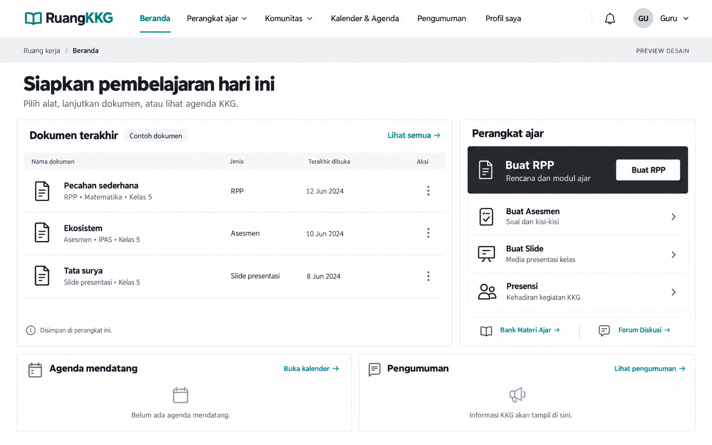

# Rencana dashboard minimalis monokrom

Tanggal: 1 Oktober 2026.

Status: desain konsep 5 telah diterapkan di aplikasi lokal sesuai persetujuan pengguna. Verifikasi akhir: 573 tes lulus, build berhasil, serta 172 berkas yang dilindungi tetap identik. Catatan implementasi dan batas verifikasi tersedia di `anti-slop/audit-006-2026-10-01.md`.

## 1. Tujuan dan acuan

Dashboard setelah login menjadi ruang kerja yang sederhana, dengan dokumen pribadi sebagai bagian terbesar. Putih dan graphite membentuk hierarki; warna teal tetap hadir secukupnya pada identitas dan navigasi aktif. Kesan modern datang dari tipografi, jarak, dan susunan yang presisi.

Acuan visual adalah **konsep 5, Minimalis monokrom**, yang dipilih pengguna:



Gambar menjadi acuan suasana dan komposisi. Data contoh, tanggal, serta tombol pada gambar harus disesuaikan dengan kemampuan aplikasi yang sudah tersedia.

## 2. Cakupan penerapan

Tahap ini memprioritaskan dashboard utama setelah login untuk Guru, Operator, Admin, dan Super admin. Isi serta akses mengikuti peran yang sudah berlaku.

Pekerjaan mencakup:

- Dashboard: susunan bagian, daftar dokumen, pintasan perangkat ajar, agenda, pengumuman, dan akses komunitas.
- Bingkai aplikasi: header, navigasi, menu akun, dan tampilan notifikasi. Bingkai yang sama digunakan oleh halaman fitur biasa agar perpindahan halaman tetap konsisten.
- Tata letak desktop, tablet, dan ponsel; keadaan memuat, kosong, dan gagal memuat.

Isi formulir dan halaman fitur lainnya mempertahankan desain yang sudah dikerjakan. Panel admin dengan tata letak khusus, halaman publik, dan halaman login tidak masuk perubahan tahap ini.

### Batas yang harus dijaga

- Prompt AI, penyedia/model AI, payload permintaan, nilai formulir, dan validasi generator tetap memakai kode sebelumnya.
- Hasil Analisis CP beserta CP/TP/ATP dan dokumen turunannya, RPP/modul ajar, asesmen, slide, renderer, format unduhan, serta hasil cetak tetap sama.
- Logika penyimpanan arsip, kunci penyimpanan, hak akses, API, dan struktur database tetap sama.
- Perubahan lokal yang sudah ada menjadi titik awal pekerjaan; jangan mengembalikan proyek ke versi Git lama untuk memulai desain ini.
- CSS tambahan dibatasi pada dashboard dan bingkai aplikasi melalui media layar. Hindari aturan umum yang ikut mengubah tabel, gambar, atau isi dokumen hasil generator.

### Perlindungan khusus Analisis CP

Analisis CP menjadi modul yang dilindungi secara eksplisit, setara dengan RPP, asesmen, dan slide. Perubahan desain dashboard serta navigasi tidak boleh mengubah:

- Prompt, penyedia/model AI, payload, ekstraksi materi dari PDF/buku, proses streaming/fallback, validasi, perbaikan data, dan struktur hasil analisis.
- Data CP resmi, rumusan dan kode TP, ATP, pemetaan bab/semester/elemen, alokasi JP, serta perhitungan dokumen turunannya.
- Ketujuh keluaran yang sudah tersedia: **Data CP, Analisis CP-TP-ATP, ATP Elemen, Prota, Promes, RPE, dan KKTP**.
- Kanvas `#analisis-canvas` dan seluruh tab/elemen dokumen di dalamnya, termasuk tabel, urutan kolom/baris, penggabungan sel, kop, tanda tangan, ukuran huruf, margin, serta orientasi kertas masing-masing dokumen.
- Sinkronisasi perubahan teks pada kanvas ke data hasil, penyimpanan/pemulihan analisis, unduhan Word per dokumen, unduhan semua tujuh dokumen, serta cetak/PDF.

Selector dan token monokrom hanya berlaku pada bingkai aplikasi serta dashboard. Kanvas Analisis CP dan turunannya tidak boleh menerima penanda desain baru atau aturan gaya yang mengganti format dokumen. CSS warisan dari elemen induk juga harus diperiksa agar tampilan dokumen tidak ikut berubah.

Sebelum implementasi, simpan baseline kode, satu data analisis/arsip yang sama, tampilan semua tab, dan contoh ekspornya. Setelah implementasi, gunakan data yang sama untuk membandingkan isi, struktur, tampilan, serta hasil ekspor. Jangan memakai dua hasil generasi AI yang berbeda sebagai pembanding desain.

## 3. Susunan dashboard

### Desktop

```text
Logo/nama KKG | Beranda | Perangkat ajar | Komunitas | Agenda | Pengumuman | Akun
─────────────────────────────────────────────────────────────────────────────
Ruang kerja / Beranda
Siapkan pembelajaran hari ini
Nama pengguna, sekolah, dan konteks tahun ajaran yang tersedia

┌──────────────────────────────────────────┬─────────────────────────────────┐
│ Dokumen terakhir                         │ Perangkat ajar                  │
│                                          │ ┌─────────────────────────────┐ │
│ Nama          Jenis    Tanggal     Buka   │ │ Buat RPP                    │ │
│ Dokumen 1                                │ │ Rencana dan modul ajar      │ │
│ Dokumen 2                                │ │ [Buat RPP]                  │ │
│ Dokumen 3                                │ └─────────────────────────────┘ │
│ Dokumen 4                                │ Buat asesmen                    │
│                                          │ Buat slide                      │
│ Disimpan di perangkat ini                │ Presensi                        │
│                                          │ Bank materi · Forum diskusi     │
├──────────────────────────────────────────┴─────────────────────────────────┤
│ Agenda mendatang                      │ Pengumuman                         │
├───────────────────────────────────────┴────────────────────────────────────┤
│ Dari rekan pendidik; akses pengelolaan sesuai peran                          │
└────────────────────────────────────────────────────────────────────────────┘
```

Area dokumen mendapat sekitar dua pertiga lebar; perangkat ajar mendapat sisanya. RPP memakai bidang graphite dengan teks putih dan tombol putih agar terlihat sebagai tindakan utama. Alat pendukung memakai baris sederhana dengan pemisah tipis.

Agenda dan pengumuman berada di bawah area kerja, bukan memenuhi bagian atas dengan kartu statistik. Diskusi yang sudah tersedia tetap ditampilkan setelah bagian tersebut. Pintasan pengelolaan mengikuti peran pengguna dan ditempatkan setelah kebutuhan mengajar.

### Dokumen terakhir

- Pertahankan empat dokumen terbaru dari gabungan arsip RPP, asesmen, dan slide, diurutkan memakai `createdAt` seperti sekarang.
- Kolom desktop: **Nama dokumen**, **Jenis**, **Tanggal dibuat**, dan **Buka**.
- Nama dan subjudul memakai `title` serta `subtitle` yang sudah tersimpan. Jangan menebak kelas atau mata pelajaran dari judul jika datanya tidak tersedia.
- Tombol Buka menggunakan mekanisme pemulihan arsip yang sudah ada: menuju modul asal dengan `archiveId`.
- Keterangan **“Disimpan untuk akun Anda di perangkat ini”** tetap terlihat.
- Jika kosong, tampilkan **“Belum ada dokumen tersimpan”**, penjelasan singkat, dan tombol **“Buat RPP pertama”** yang sudah ada.

Penyesuaian terhadap gambar:

| Elemen mockup | Rencana produksi | Alasan |
|---|---|---|
| Terakhir dibuka | Tanggal dibuat | Arsip memiliki `createdAt`; aplikasi belum menyimpan waktu terakhir dibuka. |
| Menu tiga titik | Tombol Buka | Buka sudah memiliki perilaku nyata; menu baru tidak diperlukan untuk perbaikan tampilan. |
| Lihat semua | Dihilangkan pada tahap ini | Belum tersedia halaman arsip gabungan. Arsip lengkap tetap diakses melalui masing-masing alat. |
| Contoh dokumen dan tanggal contoh | Data arsip pengguna | Mockup tidak menjadi sumber data produksi. |
| Profil saya sebagai menu terpisah | Tetap di menu akun | Menghindari pengulangan akses profil. |

### Data dan peran

Guru mendapat dokumen pribadi, alat mengajar, kegiatan, dan komunitas. Operator mempertahankan pintasan operasional yang sudah tersedia. Admin dan Super admin tetap mendapat ringkasan persetujuan anggota; Guru dan Operator tidak meminta data persetujuan.

Menu berasal dari konfigurasi navigasi yang sudah ada, sehingga Analisis CP, Game Edukasi, Direktori Guru, dan alat lain tetap dapat dijangkau. Program Sekolah dan menu Administrasi mengikuti pembatasan akses saat ini.

Nama KKG, logo, nama pengguna, sekolah, tanggal, agenda, dan pengumuman diambil dari sumber yang sudah dipakai aplikasi. Jangan mengganti identitas KKG dengan nilai tetap dari gambar.

## 4. Sistem visual

| Peran warna | Usulan nilai | Pemakaian |
|---|---|---|
| Permukaan | `#FFFFFF` | Panel dan header |
| Latar | `#F4F5F6` | Latar ruang kerja |
| Graphite | `#20252A` | Judul, ikon utama, bidang RPP |
| Teks pendukung | `#525B66` | Subjudul dan metadata |
| Garis | `#D9DDE0` | Pemisah daftar dan panel |
| Teal | `#147D78` | Identitas, tautan penting, navigasi aktif |

Nilai ini merupakan usulan token. Kontras teks dan kontrol harus diukur saat implementasi, termasuk keadaan hover, fokus, dan disabled.

- Gunakan Plus Jakarta Sans yang sudah tersedia untuk judul, serta Inter/system sans untuk isi. Bobot dan ukuran memberi kesan monokrom tanpa menambah unduhan font.
- Judul halaman memakai skala responsif sekitar 28–36 px. Isi utama sekitar 16 px; metadata sekitar 14 px.
- Jarak utama 24–32 px pada desktop dan 16–20 px pada ponsel, dengan skala dasar 4 px.
- Sudut 6–8 px untuk panel dan kontrol, bukan bentuk kapsul pada semua elemen.
- Panel biasa datar. Bayangan ringan hanya untuk dropdown atau panel yang benar-benar berada di atas konten lain.
- Ikon memakai aset/library yang sudah tersedia, berwarna graphite, dan terkait tindakan atau jenis dokumen.
- Transisi hover/fokus singkat sekitar 150–200 ms. Hindari animasi berulang; hormati reduced motion.
- Referensi utama adalah tema terang. Jika pengaturan tema yang sudah ada memungkinkan tema gelap, periksa keterbacaan dan pertahankan perilakunya; jangan menambahkan pengalih tema baru untuk tahap ini.

Dials: **ENERGY 2 / RHYTHM 2 / MOTION 1**. Fokus visual adalah dokumen pribadi dan tindakan RPP. Ruang kosong memisahkan kelompok tugas; teal menandai identitas atau tindakan, bukan menghias setiap panel.

## 5. Navigasi dan responsivitas

### Navigasi desktop

Pada lebar yang cukup, sidebar diganti dengan menu atas: Beranda, Perangkat ajar, Komunitas, Agenda, dan Pengumuman. Administrasi hanya muncul untuk peran yang saat ini berhak mengaksesnya. Profil, pemasangan aplikasi, dan keluar akun tetap tersedia di menu akun.

Dropdown dibuka dengan klik, sentuhan, Enter, atau Space. Escape menutup dan mengembalikan fokus ke pemicu. Klik di luar menutup dropdown. Penanda halaman aktif, `aria-expanded`, dan hubungan pemicu-panel harus sesuai keadaan sebenarnya.

Gunakan konfigurasi menu yang sudah ada sebagai satu sumber; jangan membuat daftar izin baru. ID panel desktop, menu akun, dan drawer mobile harus tetap unik. Menu tidak boleh menutupi notifikasi atau memutus tombol kembali/navigasi yang sudah tersedia.

### Reflow

| Rentang awal untuk perencanaan | Susunan yang direncanakan |
|---|---|
| Desktop lebar, sekitar 1280 px ke atas | Menu atas lengkap; dokumen dan alat dua kolom; agenda dan pengumuman dua kolom. |
| Tablet/laptop sempit, sekitar 768–1279 px | Header ringkas dan tombol Menu; dokumen selebar area kerja; alat pendukung dapat menjadi dua kolom; agenda dan pengumuman berdampingan jika isinya masih terbaca. |
| Ponsel, di bawah sekitar 768 px | Satu kolom; baris dokumen menjadi daftar vertikal dengan jenis, tanggal, dan tombol Buka; header ringkas serta navigasi bawah yang sudah ada. |

Breakpoint akhir ditentukan setelah diuji dengan nama KKG panjang, peran admin, judul dokumen panjang, dan perubahan lebar layar. Hindari menyembunyikan overflow untuk menutupi masalah tata letak.

Urutan ponsel: sambutan singkat, dokumen terakhir, perangkat ajar, agenda, pengumuman, lalu komunitas dan akses sesuai peran. Keadaan dokumen kosong tetap menyediakan akses langsung Buat RPP. Navigasi bawah mempertahankan akses cepat perangkat ajar.

Target sentuh sedikitnya 44 × 44 px. Sisakan jarak antarkontrol, ruang untuk navigasi bawah, serta safe area. Fokus keyboard mengikuti susunan yang dapat dipahami; isi terakhir tidak boleh tertutup header atau bar bawah.

## 6. Tahapan pelaksanaan

| Tahap | Pekerjaan | Hasil yang harus tersedia sebelum lanjut |
|---|---|---|
| 1. Catat kondisi awal | Simpan tangkapan layar, jalankan pemeriksaan awal yang relevan, dan catat berkas logika/output yang harus tetap sama. Untuk Analisis CP, simpan juga data analisis yang sama, semua tab, dan contoh tujuh ekspor. Pakai kondisi kerja saat itu sebagai baseline. | Acuan desktop/mobile, baseline Analisis CP, dan daftar batas perubahan. |
| 2. Tetapkan token | Buat token monokrom yang hanya dipakai dashboard serta bingkai aplikasi. Saat implementasi diminta, catat arah pilihan ini di `DESIGN.md`. | Warna, tipografi, jarak, dan keadaan kontrol konsisten. |
| 3. Susun navigasi | Terapkan menu atas, dropdown, header ringkas, serta drawer mobile memakai data dan izin yang sudah ada. | Seluruh tujuan navigasi dapat diakses sesuai peran. |
| 4. Susun dashboard | Pindahkan dokumen ke area utama dan alat ke kanan; rapikan agenda, pengumuman, komunitas, dan pengelolaan peran. Pertahankan ID target pemuatan data. | Keadaan berisi, kosong, memuat, dan gagal memuat tampil dengan benar. |
| 5. Rapikan lintas layar | Uji reflow, keyboard, kontras, fokus, nama panjang, dan navigasi bawah. | Tidak ada teks/tombol terpotong atau halaman bergeser horizontal. |
| 6. Verifikasi dan tinjau | Jalankan tes yang relevan dan build; bandingkan dokumen/unduhan/cetak dengan baseline, termasuk seluruh keluaran Analisis CP; lakukan audit antislop setelah pekerjaan sesuai pilihan pengguna. | Screenshot akhir, bukti keluaran Analisis CP tetap sama, hasil pemeriksaan, dan perubahan yang dapat ditinjau sebelum penerapan ke situs. |

## 7. Peta berkas saat implementasi

Bagian ini menjadi pegangan pelaksana. Pekerjaan saat ini hanya membuat dokumen rencana dan menyimpan salinan preview.

| Berkas | Peran perubahan yang direncanakan |
|---|---|
| `public/static/js/pages/educator-dashboard.js` | Susunan HTML dashboard serta penyajian daftar dokumen; pertahankan pemilahan data, urutan arsip, izin, dan pemuatan API. |
| `public/static/js/layouts/workspace.js` | Header, navigasi desktop/mobile, serta bingkai aplikasi. |
| `public/static/js/main.js` | Menghubungkan tampilan menu atas dengan konfigurasi navigasi yang sudah ada dan pengendali UI seperlunya. |
| `src/styles/dashboard-monochrome.css` | Berkas baru yang diusulkan untuk token, tata letak, dan keadaan kontrol; selector dibatasi ke dashboard serta bingkai aplikasi, dalam media layar. |
| `src/styles/input.css` | Mengimpor sumber CSS monokrom. |
| `public/static/style.css` | Hasil proses build CSS, bukan berkas yang diedit manual. |
| `tests/educator-workspace.test.ts` | Mempertahankan tes arsip pribadi, pemulihan dokumen, akses peran, dan kegagalan API; sesuaikan hanya pemeriksaan yang terkait struktur UI. |
| `DESIGN.md` | Mencatat arah monokrom setelah masuk tahap implementasi. Saat rencana ini dibuat, arah produksi belum ditimpa. |

Tidak perlu migrasi database, penggantian framework, atau pustaka komponen baru. Proyek saat ini memakai JavaScript biasa, Hono/Vite, dan Tailwind; rencana mengikuti struktur tersebut.

### Berkas Analisis CP yang dilindungi

- `public/static/js/pages/analisis-cp.js` dan seluruh berkas di `public/static/js/pages/analisis-cp/`, terutama `renderers.js`, `downloaders.js`, `validator.js`, serta pengolahan materi dan alokasi waktu.
- `src/routes/analisis-cp.ts`, termasuk prompt, endpoint generasi, ekspor, serta proses validasi yang dipanggilnya.
- Generator Word di `src/lib/docx/`: `analisis-cp.ts`, `capaian-pembelajaran.ts`, `atp-elemen.ts`, `prota.ts`, `promes.ts`, `rpe.ts`, dan `kktp.ts`.
- Data dan logika pendukung seperti `src/lib/cp-data.ts`, `src/lib/cp-document-data.ts`, `src/lib/cp-validator.ts`, `src/lib/alokasi-waktu.ts`, dan `src/lib/curriculum-database.ts`.

Berkas tersebut menjadi bagian daftar baseline yang harus tetap sama selama redesain dashboard. Jangan mengubah logika atau formatnya untuk menyesuaikan tampilan monokrom.

## 8. Kriteria penerimaan

- [ ] Pada desktop, dokumen menjadi area terbesar; RPP terlihat jelas di kolom alat.
- [ ] Tidak ada data contoh dari gambar yang muncul sebagai data pengguna.
- [ ] Label tanggal sesuai `createdAt`; subjudul hanya memakai data tersimpan yang tersedia.
- [ ] Empat jenis pintasan membuka modul yang benar, tanpa mengubah nilai atau perilaku generator.
- [ ] Membuka arsip mengembalikan isi dokumen yang sama; arsip akun lain tidak muncul.
- [ ] Hak akses Guru, Operator, Admin, dan Super admin sama seperti baseline.
- [ ] Menu akun, notifikasi, navigasi kembali, dan drawer tetap berfungsi.
- [ ] Kegagalan satu sumber data tidak menghilangkan alat serta bagian lain. Gagal memuat berbeda dari keadaan kosong dan menyediakan Coba lagi jika tersedia.
- [ ] Di 320, 375, 768, 1024, 1280, 1440, dan 1920 px, serta ketika diperbesar, tidak ada overflow atau kontrol tertutup. Uji juga perubahan ukuran di antara titik tersebut.
- [ ] Menu dapat digunakan dengan keyboard; fokus terlihat; kontras teks biasa sedikitnya 4,5:1 dan teks besar sedikitnya 3:1.
- [ ] CSS dashboard tidak mengubah tampilan dokumen hasil, pratinjau slide, mode presentasi, atau hasil cetak.
- [ ] Prompt, payload, ekstraksi materi, validasi, serta data hasil Analisis CP tidak berubah dibanding baseline.
- [ ] Dengan data analisis yang sama, isi dan format Data CP, Analisis CP-TP-ATP, ATP Elemen, Prota, Promes, RPE, dan KKTP tetap sama di kanvas, unduhan Word, serta cetak/PDF.
- [ ] Unduhan satu dokumen dan unduhan semua tujuh dokumen Analisis CP tetap berfungsi dengan susunan, tabel, kop, margin, dan orientasi seperti baseline.
- [ ] Penanda/selector monokrom tidak diterapkan ke `#analisis-canvas` atau isi dokumennya; sinkronisasi perubahan teks dan pemulihan analisis tetap bekerja.
- [ ] Logika prompt, payload, penyedia AI, renderer, formatter, dan unduhan dibandingkan dengan baseline dan tetap sama.
- [ ] Pemeriksaan otomatis yang relevan serta build selesai dengan hasil tercatat.

Saat implementasi, jalankan `npm test` dan `npm run build`, lalu uji alur dokumen menggunakan arsip atau fixture lokal. Verifikasi hasil cetak dan unduhan dari isi yang sama; tidak perlu memanggil AI hanya untuk memeriksa desain. Pengujian otomatis baru dibatasi pada perilaku yang berisiko berubah, misalnya izin navigasi dan pemulihan arsip, bukan sekadar menyalin struktur CSS.

Untuk Analisis CP, pemeriksaan harus mencakup tes yang sudah tersedia di `tests/analisis-cp.test.ts` dan `tests/prota-promes-kktp.test.ts`. Bandingkan isi serta struktur dokumen Word dari data yang sama, bukan hanya checksum berkas unduhan karena metadata atau waktu pembuatan berkas dapat berbeda. Pemeriksaan hash kode yang dilindungi tetap dilakukan untuk memastikan sumber generator dan renderer tidak berubah.

## 9. Risiko dan cara menanganinya

| Risiko | Penanganan dalam rencana |
|---|---|
| Menu atas terlalu padat untuk nama KKG panjang atau menu admin | Beralih ke header ringkas pada titik ketika isi tidak lagi muat; semua menu tetap ada di drawer. |
| Gaya monokrom ikut mengubah hasil dokumen | Batasi media dan selector, lindungi berkas generator/output, dan bandingkan arsip, cetak, serta unduhan dengan baseline. |
| CSS bingkai aplikasi diwariskan ke kanvas Analisis CP | Kecualikan `#analisis-canvas` beserta isi dokumennya; periksa semua tab dan tujuh ekspor menggunakan data baseline yang sama. |
| Tabel sulit dibaca di ponsel | Ubah menjadi daftar vertikal dengan informasi yang sama; tidak memaksa tabel desktop menjadi kecil. |
| Mockup menjanjikan metadata atau tombol yang belum tersedia | Gunakan penyesuaian pada bagian 3; jangan menambah fitur backend untuk meniru gambar. |
| Perubahan lama ikut tertimpa | Catat kondisi awal dan buat perubahan terarah; pengembalian hanya menyentuh patch tahap ini. |

Desain telah diterapkan pada dashboard setelah login dan navigasi bersama. Gambar hasil tersedia di `docs/design/dashboard-monokrom/hasil-desktop.png` serta `hasil-ponsel.png`. Penerapan masih lokal; publikasi situs belum dilakukan.

## 10. Catatan verifikasi implementasi

Daftar penerimaan pada bagian 8 tetap menjadi daftar persyaratan, bukan klaim bahwa setiap skenario manual sudah dijalankan. Bukti yang tercatat:

- Desktop memakai bidang dokumen lebih besar dari perangkat ajar; RPP memakai graphite. Data, tanggal dibuat, pemulihan arsip, dan pembatasan per akun diuji pada 12 tes ruang kerja.
- Tujuh tes navigasi memeriksa kesamaan tujuan berdasarkan empat peran, satu menu terbuka, penutupan saat fokus keluar, dan fokus kembali melalui Escape.
- Keadaan kosong diperiksa pada akun lokal; daftar empat dokumen dengan judul panjang diperiksa menggunakan fixture terpisah. Lebar 320, 375, 768, 1024, 1280, 1440, dan 1920 px tidak menghasilkan overflow.
- Kontras: 72 elemen teks desktop dan 66 elemen teks ponsel memenuhi ambang yang relevan; rasio terendah 4,54:1. Inisial akun memakai graphite untuk memperbaiki rasio awal 4,47:1.
- Tujuh kanvas Analisis CP dengan data yang sama memiliki isi serta tanda tangan gaya yang cocok pada 1.658 elemen, masing-masing mencakup 478 properti non-custom. Pembandingan ini menguji dampak lapisan CSS monokrom terhadap kanvas, bukan dua generasi AI.
- Tujuh generator Word yang sumbernya terbukti identik menghasilkan tujuh bagian XML Word per dokumen yang cocok saat dijalankan ulang menggunakan fixture sama. Metadata waktu pada berkas ZIP tidak menjadi dasar pembandingan.
- Tes Analisis CP (51), Prota/Promes/KKTP (18), ekspor RPP, asesmen, dan presentasi termasuk dalam 573 tes yang lulus. Print CSS serta fungsi orientasi tidak diubah. Dialog cetak/PDF browser dan pengunduhan batch dari akun pengguna tidak dijalankan manual.
- Saat berpindah cepat dari panel admin khusus, tercatat error lama karena pemuatan admin selesai setelah elemen dilepas. Berkas admin tersebut identik dengan baseline; perubahan dashboard tidak memperluas perbaikan ke panel itu.

Fixture pengujian tidak dimasukkan ke aset publik hasil build. Bukti pemeriksaan dan dokumen uji disimpan lokal di `.wrangler/qa/monochrome/`.
