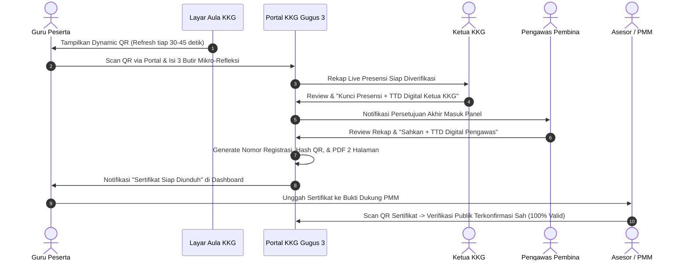

# Cetak Biru (Blueprint): Akun & Fitur Khusus Pengawas Sekolah
**Portal Digital KKG Gugus 3 Wanayasa, Kabupaten Purwakarta**  
*Status Dokumen: Rencana Pengembangan (Backlog / Implementasi Mendatang)*  
*Tanggal Penyusunan: 6 Oktober 2026*

---

## 1. Latar Belakang & Filosofi Peran
Sesuai amanat **Permendikbudristek No. 23 Tahun 2023** tentang Jabatan Fungsional Pengawas Sekolah serta paradigma Kurikulum Merdeka, peran pengawas sekolah telah bertransformasi secara fundamental:
- **Dari "Inspektur Administratif"** (pemeriksa berkas fisik di atas meja).
- **Menjadi "Pendamping, Fasilitator, dan Mitra Transformasi Satuan Pendidikan"** (Coaching, Mentoring, Fasilitasi Refleksi, dan Evaluasi Peningkatan Mutu Berbasis Data).

Dalam konteks Portal Digital KKG Gugus 3 Wanayasa, akun khusus **Pengawas Sekolah / Pengawas Pembina** dirancang untuk memberikan sudut pandang pengawasan lintas sekolah (*cross-school visibility*) tanpa dibebani kerumitan teknis pengelolaan sistem.

---

## 2. Karakteristik & Kebutuhan Pengguna (User Persona)

| Karakteristik | Keterangan |
|---|---|
| **Bukan Guru Harian** | Tidak menyusun RPP atau butir soal untuk mengajar setiap hari di kelas, melainkan mengamati, menelaah, dan membimbing perangkat karya para guru. |
| **Bukan Admin Teknis** | Tidak mengelola API Key AI, manajemen database, atau konfigurasi teknis Cloudflare. |
| **Kebutuhan Utama** | Supervisi akademik digital, telaah rubrik perangkat ajar, pemantauan partisipasi KKG se-Gugus, pengisian instrumen observasi klinis, dan penyusunan laporan pengawasan ke Korwil / Dinas Pendidikan Purwakarta. |

---

## 3. Matriks Hak Akses (Role-Based Access Control / RBAC)

Perbandingan hak akses role `pengawas` dengan role lainnya di portal:

| Modul / Fitur | Guru (`user`) | Operator (`operator`) | Pengawas (`pengawas`) | Admin (`admin`) |
|---|:---:|:---:|:---:|:---:|
| **Generator AI (RPP, Soal, Proker, Slide)** | Buat pribadi | Buat pribadi | Dapat mencoba + Lihat arsip se-Gugus | Akses penuh |
| **Arsip Perangkat Ajar Guru** | Hanya dokumen milik sendiri | Dokumen sekolahnya | **Lintas Sekolah Binaan (Read-Only + Telaah)** | Akses penuh |
| **Telaah & Catatan Supervisi Perangkat** | Menerima catatan feedback | - | **Beri Skor Rubrik & Catatan Pembinaan** | Akses penuh |
| **Instrumen Supervisi & Observasi Digital** | Mengisi refleksi mandiri | - | **Isi Instrumen & Ekspor Laporan Resmi** | Akses penuh |
| **Rekapitulasi Kehadiran KKG se-Gugus** | Riwayat kehadiran pribadi | Kelola absensi kegiatan | **Lihat Rekap Agregat per Sekolah Binaan** | Akses penuh |
| **Audit Mutu Soal & Bank Soal Gugus** | Akses bank soal publik | Akses bank soal | **Audit Sebaran Kognitif + Endorse Soal** | Akses penuh |
| **Manajemen Akun & Pengaturan Sistem** | Profil pribadi | Kelola data sekolah | ❌ (Dibatasi demi keamanan) | Akses penuh |

---

## 4. Arsitektur Menu & Fitur Ideal Pengawas

### 4.1. Dashboard Eksekutif Pengawas (*Executive Overview*)
Halaman utama yang langsung menyajikan potret mutu pembelajaran di wilayah binaan:
1. **Indeks Kesiapan Perangkat Ajar**:
   - Persentase kelengkapan administrasi guru di Gugus 3 (Modul Ajar/RPP, Analisis CP, Asesmen & Kisi-kisi).
2. **Radar Kinerja & Keaktifan per Sekolah**:
   - Grafik komparatif antar-sekolah (SDN 1 Sukadami, SDN Raharja, SDN 2 Wanayasa, dll.) mengenai keaktifan penyusunan perangkat pembelajaran.
3. **Rekapitulasi Partisipasi KKG**:
   - Rata-rata tingkat kehadiran guru per sekolah pada agenda rutin KKG bulanan.
4. **Antrean Telaah Menunggu (Pending Reviews)**:
   - Notifikasi draf RPP/Asesmen yang diajukan guru untuk ditelaah pengawas.

---

### 4.2. Ruang Telaah Perangkat Ajar (*Digital Academic Supervision*)
Fitur inti untuk memeriksa hasil karya guru secara digital dan terstruktur:
1. **Pencarian & Filter Multidimensi**:
   - Filter berdasarkan: Sekolah Binaan, Jenjang Kelas (Fase A/B/C), Mata Pelajaran, dan Jenis Dokumen.
2. **Sidebar Rubrik Telaah Standar BSKAP**:
   - Pengawas membaca dokumen guru di layar canvas, sambil mengisi checklist telaah:
     - *Perumusan Tujuan Pembelajaran & Alur* (Skor 1–4)
     - *Integrasi Pembelajaran Berdiferensiasi & Deep Learning* (Skor 1–4)
     - *Kesesuaian Asesmen Awal, Formatif, & Sumatif* (Skor 1–4)
   - Kolom **Umpan Balik Kualitatif**: Saran pendampingan dan apresiasi yang membangun.
3. **Stempel Verifikasi / Pengesahan Digital**:
   - Tombol **"Sahkan / Rekomendasikan"**: Memberikan stempel digital (*"Telah Disupervisi oleh Pengawas Pembina: [Nama Pengawas], [Tanggal]"*) yang otomatis tersemat pada lembar dokumen RPP/Asesmen guru.

---

### 4.3. Instrumen Supervisi & Observasi Digital
Digitalisasi lembar supervisi konvensional:
1. **Instrumen Supervisi Administrasi Guru**:
   - Format baku 13 komponen administrasi pembelajaran.
2. **Instrumen Supervisi Klinis / Observasi Kelas**:
   - **Pra-Observasi**: Kesepakatan target perilaku dan fokus pengamatan.
   - **Observasi Kelas**: Ceklis keterlaksanaan modul ajar dan keterlibatan aktif murid.
   - **Pasca-Observasi**: Catatan refleksi bersama dan rencana tindak lanjut (RTL).
3. **Ekspor Laporan Otomatis (PDF & Word)**:
   - Format siap cetak lengkap dengan kop resmi, rekap skor, catatan pembinaan, dan tanda tangan digital untuk pelaporan berkala ke Koordinator Wilayah (Korwil) atau Dinas Pendidikan Kabupaten Purwakarta.

---

### 4.4. Radar Mutu Asesmen & Bank Soal Gugus
Menjaga kualitas evaluasi pembelajaran se-kecamatan:
1. **Audit Sebaran Level Kognitif**:
   - Memantau apakah naskah soal ulangan/sumatif yang dibuat guru-guru di gugus sudah memenuhi standar Puspendik (proporsi L1 Pemahaman, L2 Aplikasi, dan L3 HOTS Penalaran).
2. **Kurasi & Endorsement Bank Soal**:
   - Pengawas dapat menyematkan lencana **"Rekomendasi Pengawas"** pada paket soal yang bermutu tinggi agar dapat diadopsi sebagai referensi bersama di tingkat gugus/kecamatan.

---

### 4.5. AI Asisten Pengawas (*Fitur Unggulan*)
Meringankan beban administratif pengawas menggunakan mesin AI yang sudah tersedia di portal:
1. **Generator RPA (Rencana Pengawasan Akademik)**:
   - Input: Fokus permasalahan gugus (misal: "Penguatan literasi numerasi"), alokasi waktu, dan target sekolah.
   - Output: Draf dokumen RPA lengkap dengan latar belakang, skenario pendampingan (coaching/mentoring), instrumen pemantauan, dan indikator keberhasilan.
2. **Analisis Tren Kebutuhan Pelatihan KKG Berbasis Data**:
   - AI mengagregasi catatan kendala dari telaah perangkat guru dan diskusi forum KKG untuk merekomendasikan tema prioritas pertemuan KKG bulan berikutnya.

---

### 4.6. Sistem Sertifikat Presensi Digital Otomatis (TTD Ganda: Ketua KKG & Pengawas)
Menjawab kebutuhan bukti dukung RHK PMM (Pengelolaan Kinerja Guru Kemendikbudristek) dan Angka Kredit tanpa beban birokrasi manual yang rentan pemalsuan:

#### 1. Standar Regulasi & Legalitas Kedinasan
- **Regulasi Acuan**: Perdirjen GTK No. 7607/B.B1/HK.03/2023 tentang Petunjuk Teknis Pengelolaan Kinerja Guru (RHK Komunitas Belajar bernilai 4 poin).
- **Tanda Tangan Ganda (Dual Sign-Off)**:
  - **Ketua KKG Gugus 3** bertindak sebagai Penanggung Jawab Teknis Pelaksana Kegiatan.
  - **Pengawas Pembina Gugus 3** bertindak sebagai Penanggung Jawab Pembina Mutu Akademis.
- **Standar Format 2 Halaman (Sesuai Juknis BKN/PMM)**:
  - *Halaman 1 (Piagam Depan)*: Logo Tut Wuri & KKG, Nomor Surat Registrasi Resmi, Identitas Peserta (Nama lengkap + gelar, NIP/NUPTK, Sekolah/Unit Kerja), Peran (*Peserta Aktif*), Tempat & Tanggal Kegiatan, Tanda Tangan Digital Berdampingan (Ketua KKG & Pengawas) disertai stempel digital dan QR Token.
  - *Halaman 2 (Lampiran Belakang)*: Struktur Materi & Rincian Jam Pelajaran (JP) — misal 4 JP s.d. 8 JP per workshop, profil narasumber, dan tanda tangan pengesahan pengawas.

#### 2. Mekanisme Presensi Anti-Joki (*Smart Attendance Gate*)
- **Dynamic Rotating QR Code**:
  - Di proyektor aula KKG, sistem menampilkan QR Code yang berganti token rahasia secara otomatis setiap 30–45 detik (berbasis TOTP / token waktu nyata).
  - Mencegah fenomena tautan presensi difoto dan dikirim ke grup WhatsApp untuk guru yang tidak hadir di lokasi.
- **Device & Account Lock**:
  - Guru memindai QR code setelah login di aplikasi portal KKG Wanayasa.
  - 1 akun hanya dapat melakukan presensi dari 1 perangkat aktif dalam 1 sesi kegiatan.
- **Exit Ticket / Mikro-Refleksi Pembelajaran (The Learning Prerequisite)**:
  - Sertifikat tidak diberikan cuma-cuma hanya karena scan presensi. Di akhir sesi kegiatan (atau saat checkout presensi), guru wajib mengisi 3 pertanyaan refleksi ringkas (1 menit):
    1. *Gagasan baru atau praktik baik apa yang dipelajari hari ini?*
    2. *Tantangan apa yang dihadapi di kelas terkait materi ini?*
    3. *Rencana aksi nyata apa yang akan dicoba pada minggu depan?*
  - Pengisian mikro-refleksi ini menjadi syarat sistem (*gatekeeper*) agar nama guru masuk ke antrean penerbitan sertifikat.

#### 3. Alur Kerja Pengesahan Digital Bertingkat (*Dual Approval Workflow*)
1. **Penutupan Sesi oleh Ketua KKG**:
   - Ketua KKG melihat dashboard rekap peserta yang telah hadir dan menyelesaikan mikro-refleksi.
   - Ketua KKG mengklik tombol **"Kunci Presensi & Beri Persetujuan Pelaksana"** (membubuhkan tanda tangan digital Ketua KKG).
2. **Pengesahan oleh Pengawas Pembina**:
   - Pengawas menerima ringkasan kegiatan di panel pembinaan: topik materi, jumlah peserta hadir, dan ketercapaian refleksi.
   - Pengawas mengklik **"Sahkan & Terbitkan Sertifikat (Pengawas Pembina)"**.
3. **Penerbitan Batch Otomatis**:
   - Seketika sistem mengunci daftar hadir, menerbitkan nomor urut buku besar register sertifikat secara otomatis, dan me-render dokumen PDF untuk masing-masing peserta.
   - Sertifikat langsung tersedia di tab akun profil guru (*"Sertifikat & Portofolio Saya"*).

#### 4. Mesin Verifikasi Publik Anti-Pemalsuan (*Trust Engine*)
- Setiap lembar sertifikat disematkan QR Code unik dengan tautan publik:
  `https://kkg-wanayasa.app/verifikasi/sertifikat/[HASH_TOKEN_UNIK]`
- Saat dipindai oleh Kepala Sekolah, Tim Penilai Angka Kredit, atau Asesor PMM menggunakan kamera ponsel apa pun tanpa perlu login:
  - Menampilkan badge hijau: **"DOKUMEN RESMI TERVERIFIKASI"**.
  - Rincian otentik: Nama Lengkap Guru, NIP, Asal Sekolah, Nama Acara, Tanggal, Jumlah JP.
  - Waktu stempel kriptografi TTD Ketua KKG dan Pengawas.
  - Opsi unduh salinan PDF resmi langsung dari server (mencegah manipulasi teks hasil editan Canva/Photoshop).

---

## 5. Alur Diagram Integrasi (User Journey)



---

## 6. Rencana Teknis Implementasi (Untuk Tahap Realisasi)

### 6.1. Skema Database (D1 / SQLite)
1. **Penyesuaian Role `users`**:
   - Menambahkan `'pengawas'` pada constraint `role_label` atau `role`.
   - Menambahkan field `sekolah_binaan_ids` (JSON array ID sekolah binaan atau `ALL` untuk seluruh gugus).

2. **Tabel Baru `supervisi_records`**:
   ```sql
   CREATE TABLE IF NOT EXISTS supervisi_records (
       id INTEGER PRIMARY KEY AUTOINCREMENT,
       pengawas_id INTEGER NOT NULL REFERENCES users(id),
       guru_id INTEGER NOT NULL REFERENCES users(id),
       sekolah_id INTEGER REFERENCES sekolah(id),
       tipe_dokumen TEXT NOT NULL, -- 'rpp', 'kisi', 'analisis-cp', 'observasi_kelas'
       dokumen_id TEXT,
       skor_total REAL,
       rubrik_json TEXT, -- Detail skor per butir indikator
       catatan_pembinaan TEXT,
       rekomendasi_tindak_lanjut TEXT,
       status TEXT NOT NULL DEFAULT 'selesai', -- 'draf', 'selesai'
       created_at DATETIME DEFAULT CURRENT_TIMESTAMP,
       updated_at DATETIME DEFAULT CURRENT_TIMESTAMP
   );
   ```

3. **Tabel Manajemen Kegiatan & Sertifikat (`kegiatan_kkg` & `sertifikat_presensi`)**:
   ```sql
   -- Data sesi pertemuan KKG bulanan / workshop
   CREATE TABLE IF NOT EXISTS kegiatan_kkg (
       id INTEGER PRIMARY KEY AUTOINCREMENT,
       judul_kegiatan TEXT NOT NULL,
       deskripsi TEXT,
       tanggal_kegiatan DATE NOT NULL,
       jam_mulai TEXT,
       jam_selesai TEXT,
       tempat TEXT DEFAULT 'Gugus 3 Wanayasa',
       alokasi_jp INTEGER DEFAULT 4,
       materi_struktur_json TEXT, -- Halaman 2: array materi & JP
       narasumber_nama TEXT,
       narasumber_instansi TEXT,
       qr_secret_seed TEXT, -- Kunci rahasia untuk dynamic rotating QR
       is_presensi_active INTEGER DEFAULT 0,
       is_locked INTEGER DEFAULT 0,
       ttd_ketua_at DATETIME,
       ttd_pengawas_at DATETIME,
       created_at DATETIME DEFAULT CURRENT_TIMESTAMP
   );

   -- Rekap kehadiran & penerbitan sertifikat peserta
   CREATE TABLE IF NOT EXISTS sertifikat_presensi (
       id INTEGER PRIMARY KEY AUTOINCREMENT,
       kegiatan_id INTEGER NOT NULL REFERENCES kegiatan_kkg(id),
       user_id INTEGER NOT NULL REFERENCES users(id),
       nomor_registrasi TEXT UNIQUE, -- e.g. 421.2/045/KKG-G3.WNY/X/2026
       refleksi_konsep TEXT,
       refleksi_tantangan TEXT,
       refleksi_rencana_aksi TEXT,
       token_hash TEXT UNIQUE NOT NULL, -- UUID/SHA256 untuk URL verifikasi publik
       status_sertifikat TEXT DEFAULT 'terbit', -- 'menunggu_approval', 'terbit', 'ditolak'
       file_url TEXT,
       waktu_presensi DATETIME DEFAULT CURRENT_TIMESTAMP
   );
   ```

### 6.2. Permission Matrix (`src/lib/permissions.ts`)
- Menambahkan permission:
  - `PERMISSIONS.SUPERVISI_VIEW_ALL = 'supervisi:view_all'`
  - `PERMISSIONS.SUPERVISI_REVIEW = 'supervisi:review'`
  - `PERMISSIONS.SUPERVISI_EXPORT = 'supervisi:export'`
  - `PERMISSIONS.RPA_GENERATE = 'rpa:generate'`
  - `PERMISSIONS.SERTIFIKAT_SIGN_KETUA = 'sertifikat:sign_ketua'`
  - `PERMISSIONS.SERTIFIKAT_SIGN_PENGAWAS = 'sertifikat:sign_pengawas'`
  - `PERMISSIONS.SERTIFIKAT_VIEW_ALL = 'sertifikat:view_all'`

### 6.3. Tampilan Antarmuka (UI Front-End)
- Navigasi khusus saat login sebagai Pengawas:
  - 🏠 **Dashboard Bina** (`/pengawas/dashboard`)
  - 📂 **Ruang Telaah Perangkat** (`/pengawas/telaah`)
  - 📝 **Instrumen Supervisi** (`/pengawas/instrumen`)
  - 📊 **Rekapitulasi KKG** (`/pengawas/rekap-kkg`)
  - 📜 **Persetujuan Sertifikat** (`/pengawas/sertifikat-approval`)
  - 🤖 **Asisten RPA** (`/pengawas/rpa`)
- Halaman Publik:
  - 🔍 **Verifikasi Sertifikat Resmi** (`/verifikasi/sertifikat/:token`)
- Halaman Guru:
  - 🎓 **Portofolio Sertifikat Saya** (`/sertifikat-saya`)

